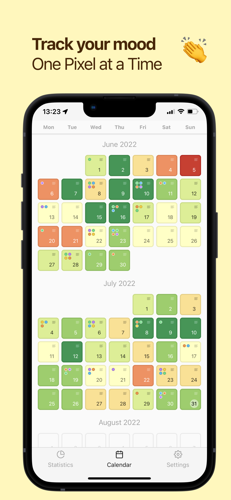

<br />
<p align="center">
  <a href="https://github.com/mrzmyr/pixy-mood-tracker">
    
  </a>

  <h3 align="center">Pixy Mood Tracker</h3>

  <p align="center">Minimalistic app to track your mood within one pixel a day.</p>
  <p align="center">
    <a href="https://apps.apple.com/de/app/pixy-mood-tracker/id1605327124">Apple App Store</a>
    ·
    <a href="https://play.google.com/store/apps/details?id=com.devmood.pixymoodtracker">Google Play Store</a>
  </p>
</p>

## About The Project

<p align="center">
  
</p>

### Built With

This section should list any major frameworks that you built your project using. Leave any add-ons/plugins for the acknowledgements section. Here are a few examples.

* [React Native](https://reactnative.dev/)
* [Expo](https://expo.dev/)

## Development

**Setup**

1. Clone the repo
```shell
$ git clone https://github.com/mrzmyr/pixy-mood-tracker.git
```
2. Install dependencies
```shell
$ yarn
```
3. Start local server
```shell
$ yarn start
```

**Release Version**

```
$ npx standard-version --release-as [major|minor|patch]
```

**Environments** (`eas.json`)

- `development` Builds for local development on phisical devices
- `emulator`: Builds for local development in iOS Simulator or Android Emulator 
- `preview`: Builds used for Testflight and Android Internal Testing
- `production`: Builds used for production

## Building

### Development

**iOS Device**
1. `yarn build:ios:dev` creates a `.ipa` file
2. Install `.ipa` file via [Apple Configurator](https://apps.apple.com/us/app/apple-configurator/id1037126344?mt=12)

**Android Device**
1. `yarn build:android:dev` create a `.apk` file
2. Install manually (enable "Install from unknown sources")

**iOS Simulator**
1. `yarn build:ios:emulator` create an `.ipa` file
2. Install `.ipa` file via 

**Android Emulator**
1. `yarn build:android:emulator` creates an `.apk` file
2. Install the `.apk` file via drag and drop

### Preview

**iOS (TestFlight)**
1. `yarn build:ios:preview` creates a `.ipa` file
2. Submit `.ipa` file to App Store via `yarn submit:ios`

**Android (Goolge Play Console - Internal testing)**
1. `yarn build:android:preview` create a `.aab` file
2. Submit `.aab` file to Google Play Console via `yarn submit:android`

### Production

**iOS**
1. `yarn buiild:ios:prod` creates a `.ipa` file
2. Submit `.ipa` file via `yarn submit:ios`

**Android**
1. `yarn buiild:android:prod` creates a `.aab` file
2. Submit `.aab` file via `yarn submit:android`

## Releasing

### Preview

1. (If native changes) `yarn publish:preview` (iOS and Android builds are built and submited for testing)
2. (If native changes) Submit App to Review in Google Play Console
2. Merge a PR to `preview` branch (automatically publishing a release to all betatesters)

### Production

1. (If native changes) `yarn publish:production` (iOS and Android builds are built and submited for testing)
2. (If native changes) Submit App to Review in Google Play Console
3. (If native changes) Submit App to Review in App Store Connect
4. Merge a PR to `production` branch (automatically publishing a release to all users)

## Contributing

Contributions are what make the open source community such an amazing place to learn, inspire, and create. Any contributions you make are **greatly appreciated**.

1. Fork the Project
2. Create your Feature Branch (`git checkout -b feat-add-feature`)
3. Commit your Changes (`git commit -m 'feat: my feature'`)
4. Push to the Branch (`git push origin feat-add-feature`)
5. Open a Pull Request

## Contact

mrzmyr [@mrzmyr](https://twitter.com/mrzmyr)

Project Link: [https://github.com/mrzmyr/pixy-mood-tracker](https://github.com/mrzmyr/pixy-mood-tracker)

### Supported Languages

| Name | Key |
|---|---|
| Arabic | ar |
| Catalan | ca |
| Chinese (Simplified) | zh |
| Croatian | hr |
| Czech | cs |
| Danish | da |
| Dutch | nl |
| English | en |
| Finnish | fi |
| French | fr |
| German | de |
| Greek | el |
| Hebrew | he |
| Hindi | hi |
| Hungarian | hu |
| Indonesian | id |
| Italian | it |
| Japanese | ja |
| Korean | ko |
| Malay | ms |
| Norwegian | no |
| Polish | pl |
| Portuguese | pt |
| Romanian | ro |
| Russian | ru |
| Slovak | sk |
| Spanish | es |
| Swedish | sv |
| Thai | th |
| Turkish | tr |
| Ukrainian | uk |
| Vietnamese | vi |
