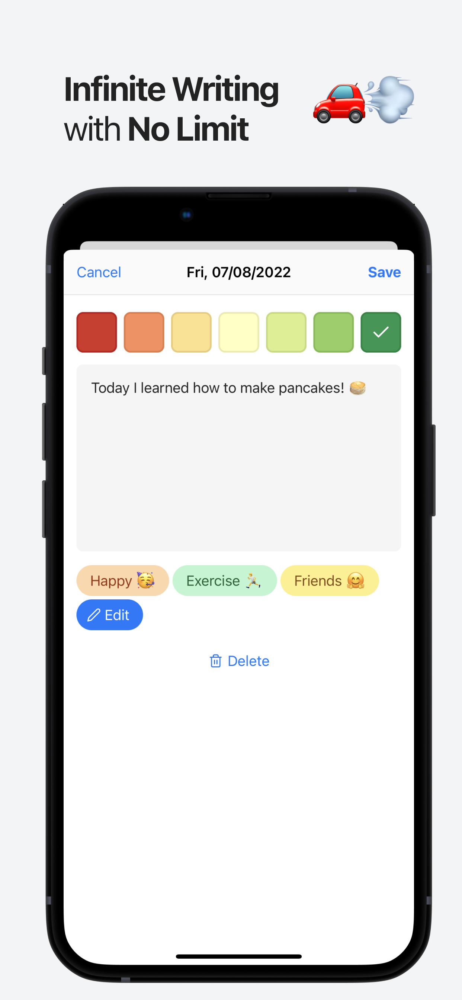
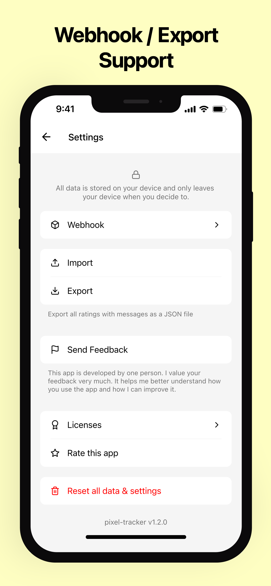
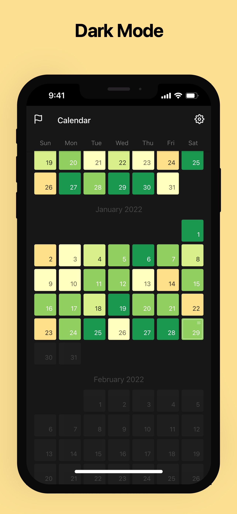

<br />
<p align="center">
  <a href="https://github.com/mrzmyr/pixy-mood-tracker">
    
  </a>

  <h3 align="center">Pixy Mood Tracker</h3>

  <p align="center">Track your mood with webhook & export functionality.</p>
  <p align="center">
    <a href="https://apps.apple.com/de/app/pixy-mood-tracker/id1605327124">Apple App Store</a>
    ·
    <a href="https://play.google.com/store/apps/details?id=com.devmood.pixymoodtracker">Google Play Store</a>
  </p>
</p>

## About The Project

<p align="center">
  
  
  
  
</p>

### Built With

This section should list any major frameworks that you built your project using. Leave any add-ons/plugins for the acknowledgements section. Here are a few examples.

* [React Native](https://reactnative.dev/)
* [Expo](https://expo.dev/)

### Development

**Setup**

1. Clone the repo
```shell
$ git clone https://github.com/mrzmyr/pixy-mood-tracker.git
```
2. Install dependencies
```shell
$ yarn
```
3. Start local server
```shell
$ yarn start
```

**Release Version**

```
$ npx standard-version --release-as [major|minor|patch]
```

## Contributing

Contributions are what make the open source community such an amazing place to learn, inspire, and create. Any contributions you make are **greatly appreciated**.

1. Fork the Project
2. Create your Feature Branch (`git checkout -b feat-add-feature`)
3. Commit your Changes (`git commit -m 'feat: my feature'`)
4. Push to the Branch (`git push origin feat-add-feature`)
5. Open a Pull Request

## Contact

mrzmyr [@mrzmyr](https://twitter.com/mrzmyr)

Project Link: [https://github.com/mrzmyr/pixy-mood-tracker](https://github.com/mrzmyr/pixy-mood-tracker)

### Supported Languages

| Name | Key |
|---|---|
| Arabic | ar |
| Catalan | ca |
| Chinese (Simplified) | zh |
| Croatian | hr |
| Czech | cs |
| Danish | da |
| Dutch | nl |
| English | en |
| Finnish | fi |
| French | fr |
| German | de |
| Greek | el |
| Hebrew | he |
| Hindi | hi |
| Hungarian | hu |
| Indonesian | id |
| Italian | it |
| Japanese | ja |
| Korean | ko |
| Malay | ms |
| Norwegian | no |
| Polish | pl |
| Portuguese | pt |
| Romanian | ro |
| Russian | ru |
| Slovak | sk |
| Spanish | es |
| Swedish | sv |
| Thai | th |
| Turkish | tr |
| Ukrainian | uk |
| Vietnamese | vi |
