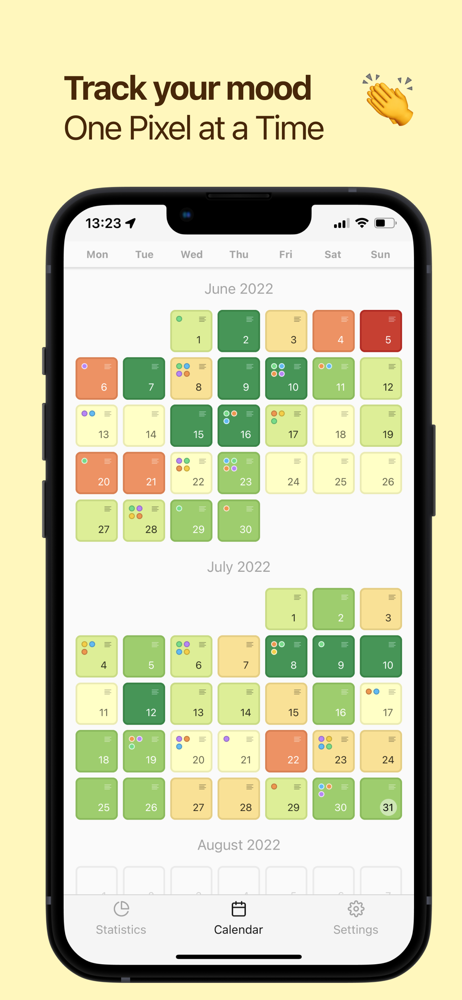

> [!IMPORTANT]
> **This project is no longer actively maintained**. While the app remains available on both the Apple App Store and Google Play Store, no new features, updates, or bug fixes will be implemented. The existing functionality will continue to work as is, but users should not expect any future improvements or support. The source code remains open and available for anyone interested in forking or learning from it. If you encounter any issues, you may still create GitHub issues, but they likely won't be addressed. Thank you to everyone who has used and supported Pixy Mood Tracker 🫶.
>
> **I do plan to eventually create a Pixy 2 version in the future**. If you're interested in providing feedback and staying updated on future developments, feel free to **join our Discord community**: https://discord.gg/tt7KRRc3uF

 

  

  <h3 align="center">Pixy Mood Tracker</h3>

  
Minimalistic app to track your mood within one pixel a day.

  

    <a href="https://apps.apple.com/de/app/pixy-mood-tracker/id1605327124">Apple App Store</a>
    ·
    <a href="https://play.google.com/store/apps/details?id=com.devmood.pixymoodtracker">Google Play Store</a>
  

## About The Project

  

### Built With

This section should list any major frameworks that you built your project using. Leave any add-ons/plugins for the acknowledgements section. Here are a few examples.

- [React Native](https://reactnative.dev/)
- [Expo](https://expo.dev/)

## Development

See [docs/development.md](./docs/development.md) for setup, build, and release instructions.

## Contributing

See [CONTRIBUTING.md](./CONTRIBUTING.md).

## Contact

mrzmyr [@mrzmyr](https://twitter.com/mrzmyr)

Project Link: [https://github.com/mrzmyr/pixy-mood-tracker](https://github.com/mrzmyr/pixy-mood-tracker)

### Supported Languages

See [docs/i18n.md](./docs/i18n.md).
