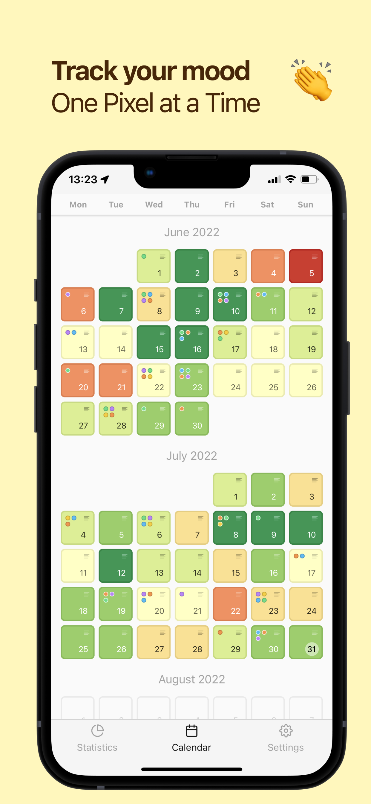

> [!IMPORTANT]
> - **Source development resumed in 2026.** See [latest source release](https://github.com/mrzmyr/pixy-mood-tracker-app/releases/latest).
> - **Store updates are pending.** App Store and Google Play still offer version 1.68.0 from December 24, 2022. See [app facts](./docs/app-facts.json) for verified release details.

 

  

  <h3 align="center">Pixy Mood Tracker</h3>

  
Minimalistic app to track your mood within one pixel a day.

  

    <a href="https://apps.apple.com/de/app/pixy-mood-tracker/id1605327124">Apple App Store</a>
    ·
    <a href="https://play.google.com/store/apps/details?id=com.devmood.pixymoodtracker">Google Play Store</a>
  

## About The Project

  

Pixy is a free, open source mood tracker for iPhone and Android. No ads, no account.

- Log mood, emotions, tags, and notes. More than one entry per day.
- Year in Pixels, calendar, filters, and statistics
- Entries stored on device. Optional iCloud or Google Drive backup. Export and import files.
- 31 languages ([docs/i18n.md](./docs/i18n.md))

Full list with status: [docs/app-facts.json](./docs/app-facts.json).

### Built With

- [React Native](https://reactnative.dev/)
- [Expo](https://expo.dev/) and [Expo Router](https://docs.expo.dev/router/introduction/)

## Development

See [docs/development.md](./docs/development.md) for setup, build, and release instructions.

## Contributing

See [CONTRIBUTING.md](./CONTRIBUTING.md).

## Contact

mrzmyr [@mrzmyr](https://twitter.com/mrzmyr)

Project Link: [https://github.com/mrzmyr/pixy-mood-tracker-app](https://github.com/mrzmyr/pixy-mood-tracker-app)

### Supported Languages

See [docs/i18n.md](./docs/i18n.md).
